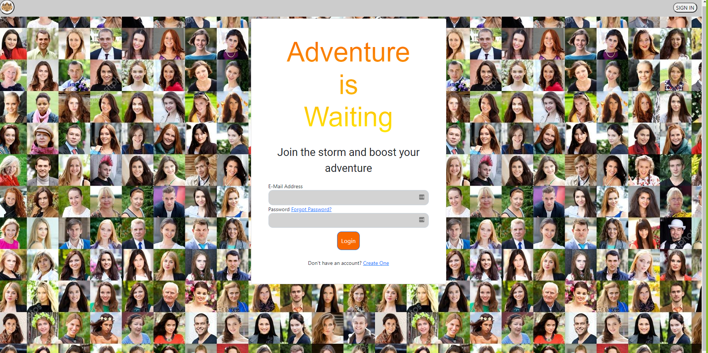

# MyAdventure

  

  ## Description
  Have you ever wished there was a social site that you could use share your life stories and find and like minded people with that were grounded and trying to survive the adventure that is life without the fake glamor that ever social site seems to drown itself in. Well we have created a new social media app that specifically caters to “adventure-minded” individuals like you. Users will be able to create and customize their own profile, share stories about their daily adventures and interact with other adventurers.
  ## Table of Contents
  * [Installation](#installation)
  * [Usage](#usage)
  * [Contributing](#Contributing)
  * [License](#license)
  * [Tests](#tests)
  * [Questions](#questions)
  ## Installation
  To install download or clone the files from the repository and open them in vscode. Then from the root directory run 'npm i' in the command line. Then from the root directory create a .env file with DB_NAME='myadventures_DB' DB_USER='' DB_PW='' and fill in your username and password for mysql.  Then  to the .env file add your cloudinary credentials CLOUD_NAME= ''API_KEY= '' API_SECRET=''.

  ## Usage
  To use this program complete the istallation instructions. Then iniate the database by logging into mysql using 'npm run seed' and running SOURCE ./db/schema.sql. Finally from the root directory run 'npm start' in the command line to run the program.
  ## ScreenShot
  
  

  ## Collaborators
  Joe Tremols
  Guillermo Fernandez
  Ralph Pierre
  Catherine Clifford
  ## License
  Licensed under the [MIT License](https://choosealicense.com/licenses/mit/)
  ## Contributing
  Anyone is allowed to contribute to this open source project. See the License section for specifics
  ## Questions
  For questions please reachout
  GitHub: [NukaGrizz](https://github.com/NukaGrizz)
  Email: nukagrizz@gmail.com
